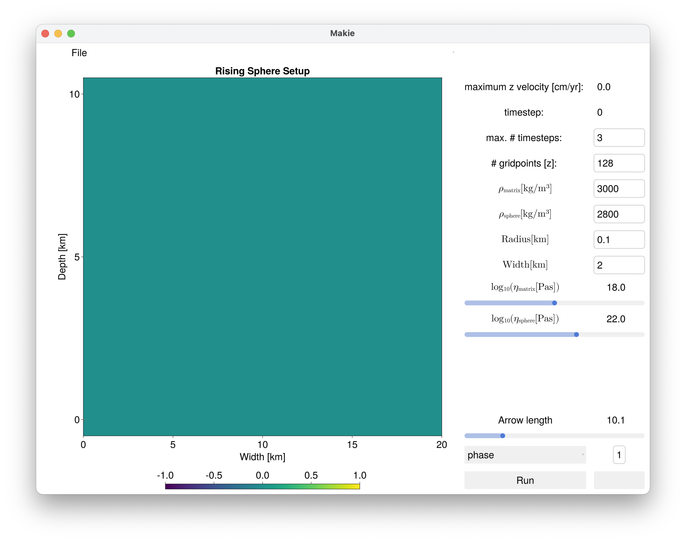
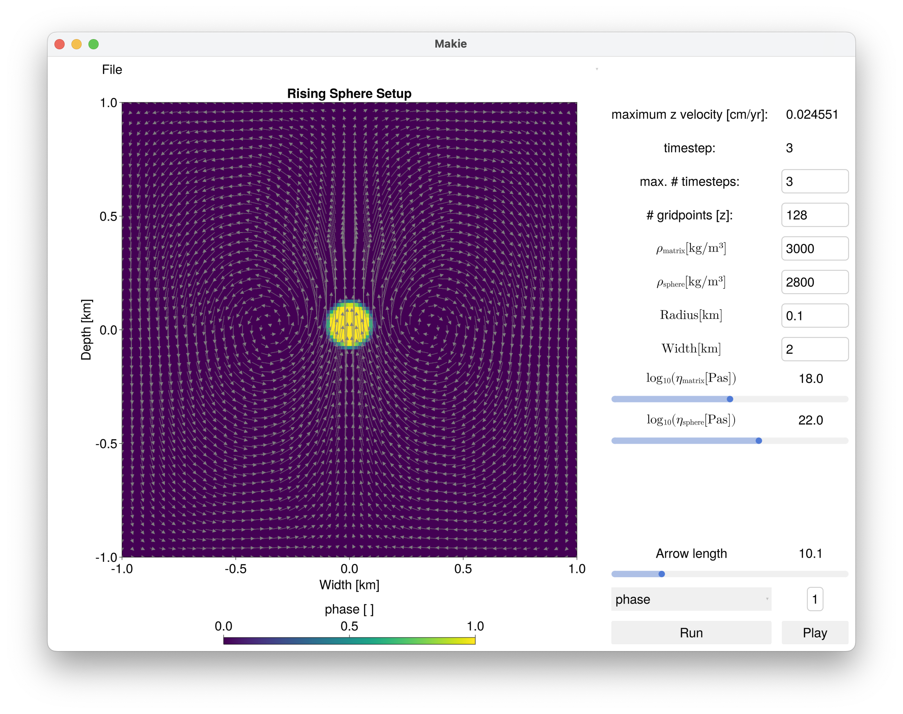
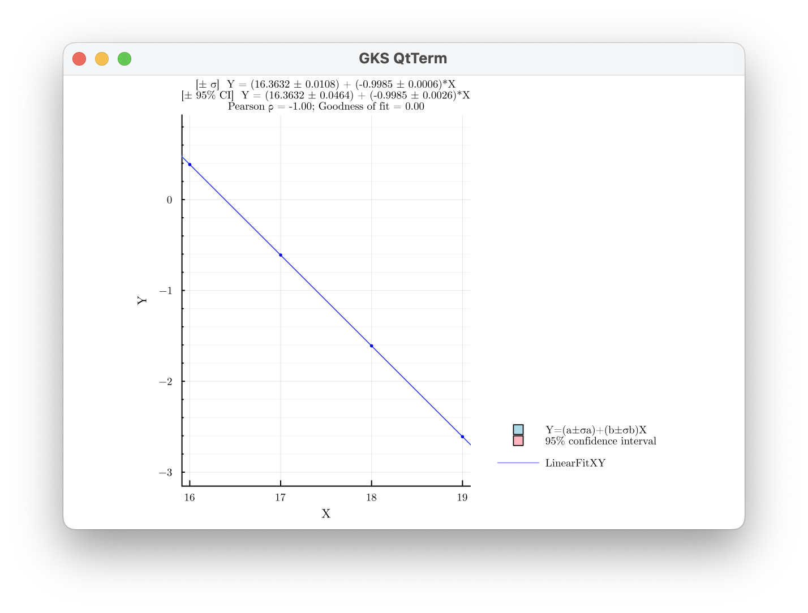
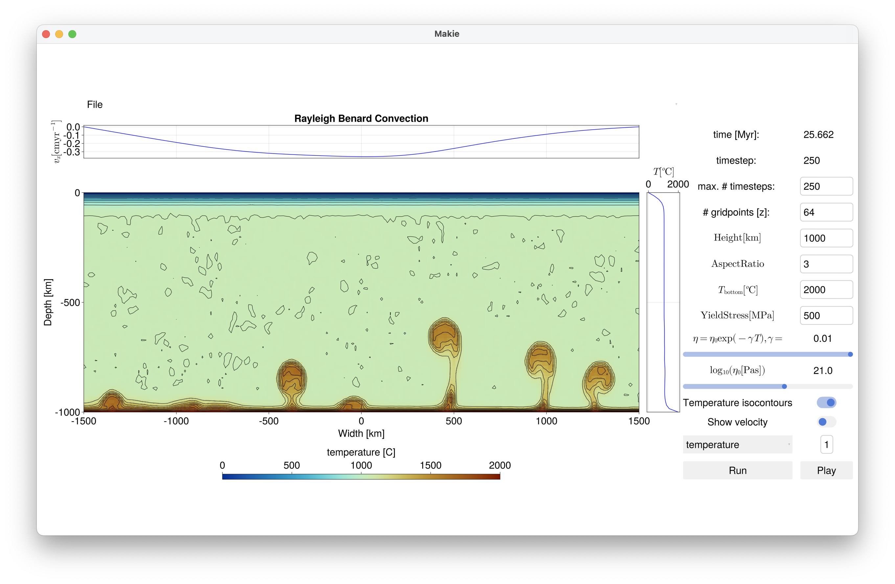

# Deriving scaling laws using numerical models 
*Boris Kaus*

## 1. Introduction
The idea of this part of the workshop is to perform experiments in the computer and get some insights in the dynamics of geological processes. We will start with a very simple example that you (hopefully) remember from your physics classes (stokes rising sphere problem).

To make things easier, we have prepared graphical user interfaces for this part of the class.  

## 2. Installing software 

We need two packages for today:
* [LinearFitXYerrors](https://github.com/rafael-guerra-www/LinearFitXYerrors.jl). If you installed this yesterday already, you don't have to do it again (try typing: `using LinearFitXYerrors` in the julia REPL)

* [InteractiveGeodynamics](https://github.com/JuliaGeodynamics/InteractiveGeodynamics.jl/tree/main/RayleighTaylorInstability) Please follow the installation instructions on the webpage. 

## 3. Rising sphere case

#### 3.1 Setting up 
For the first exercise we will be running the rising sphere example, which is in the `RisingSphere` directory.

1) Change to the main directory of InteractiveGeodynamics.jl using the julia shell (type `;` in the REPL).
```julia
shell> cd Users/kausb/.julia/dev/InteractiveGeodynamics.jl
```
2) Activate the package in the package manager (type `]` in the julia REPL)
```julia
(@v1.9) pkg> activate .
  Activating project at `~/.julia/dev/InteractiveGeodynamics.jl`

(InteractiveGeodynamics) pkg> 
```
3) Change to the RisingSphere directory using the shell (type `;` in the REPL).
```julia
shell> cd RisingSphere/
```
4) Start the GUI
```julia
julia> include("RisingSphere_LaMEM.jl")
```

This will take some time, but after a while it should open a sepate window that looks like:



Now push `Run` and it should show this in the julia REPL:
```julia
julia> [ Info: Running LaMEM simulation
args = "-nstep_max 3 -radius[0] 0.1 -eta[0] 1.0e18 -eta[1] 1.0e22 -rho[0] 3000.0 -rho[1] 2800.0  -nel_x 128 -nel_z 128 -coord_x -1.0,1.0 -coord_z -1.0,1.0"
Timestep 0
```
and after a bit:


If nothing happens after a while, push the button to the right of `Run`.
The GUI allows you to change the parameters and reports the maximum vertical velocity of the sphere. Once a calculation is finished, you can visualize it with `Play`.


#### 3.2 First simulation 
Ok, all fine. What we are simulating is a 2D simulation of a rising cylinder that is embedded in a linear viscous matrix. Now lets do some experiments in the computer.

*Exercise*
1) Visualize other fields such as density and viscosity (`visc_creep`), by the menu that says `phase` in the picture above. Press `Play` to see it in action. 
2) Change the arrow lengths. 
3) Run the simulation for more timesteps, until it reaches the top of the domain. 150 timesteps will do the job. 
4) Does the maximum vertical velocity, $v_z$, change a lot with time or is it more or less constant?
5) The default set of parameters is for a higher viscous sphere in a lower viscous matrix. Try a case with a lower viscous sphere in a higher-viscous matrix. Is the velocity higher or lower, if we keep the viscosity of the matrix the same?

#### 3.3 Systematic simulations
Our goal is to compute a scaling law for the maximum vertical velocity, $v_z$ as a function of model parameters. The ones we can change are $\rho_{matrix}, \rho_{sphere}, \eta_{matrix}, \eta_{sphere}$, radius $R$ and model width $W$. So we are looking for an equation that gives 
$v_z = f(\eta_{matrix}, \eta_{sphere}, W, R, \rho_{matrix}, \rho_{sphere})$  

In order to determine this, you can run systematic numerical experiments, in which you keep all parameter constant but very only a single one. The easiest is to run this always for 3 timesteps (as we saw earlier that $v_z$ is mostly constant with time).

To keep things simple, we initially focus on the case where i) the viscosity of the sphere is larger (at least 1000 times) than that of the matrix and ii) the boundaries of the model box are sufficiently far away from the 

##### Effect of $\eta_{matrix}$

I suggest that you collect these results in a separate file, which you call `scaling.jl`. We will perform 4 simulations:

```julia
# Effect of η matrix
ηm = [1e22, 1e22, 1e22, 1e22]
rhos = [2800, 2800, 2800, 2800]
rhom = [3000, 3000, 3000, 3000]
ηm = [1e16, 1e17, 1e18, 1e19]
Vz = [xx, xx, 0.024550937, xx]
```

If you now plot $\log_{10}(v_z)$ vs.  $\log_{10}(\eta_m)$, you can fit a line through the data points and get the powerlaw exponent (have a look at the previous class). We can use `LinearFitXYerrors` for that:

```julia
julia> using LinearFitXYerrors
julia> st = linearfitxy(log10.(ηm), log10.(Vz),  isplot=true)

>>> [± σ]  Y = (16.3632 ± 0.0108) + (-0.9985 ± 0.0006)*X 
>>> [± 95% CI]  Y = (16.3632 ± 0.0464) + (-0.9985 ± 0.0026)*X 
>>> Pearson ρ = -1.000;  Goodness of fit = 0.001 

LinearFitXYerrors.stfitxy([16.0, 17.0, 18.0, 19.0], [0.3855993033840267, -0.6105209287121266, -1.609931928137183, -2.609712102950398], [0.0, 0.0, 0.0, 0.0], [0.0, 0.0, 0.0, 0.0], [0.0, 0.0, 0.0, 0.0], 16.363212718145636, -0.9985345218428321, 0.010774928747014823, 0.000614457496206779, 0.046360776586199255, 0.0026437972233691164, 0.001373968730802677, -0.999999621333157, [-0.9985345218428321], 1)
 ```
This should also create a plot:

In this particular case:

$ \log_{10}(v_z) \propto -1 \log_{10}(\eta_m) $

which implies

$ v_z \propto \frac{1}{\eta_m} $

So now we need to determine the scaling laws for the other parameters
##### Effect of $R$
Now do the same simulations for $R$. What is the scaling coefficient? Please take into account two effects:
* We have a limited numerical resolution, which by default is 128 gridpoints. If the model width is 2 km, each grid cell has $2\textrm{km}/128=0.015625\textrm{km}$. You need several gridpoints to numerically resolve the sphere, so if your radius is very small you may get wrong results. 
* The width of the box has an impact too. So if your sphere has a radius of 0.5 km and the box is 2 km wide, there will be an effect. Therefore, it is perhaps easier to do the initial set of experiments for the case that the box width is much larger than the radius of the sphere (say 200 times), which limits boundary effects

##### Effect of $\rho_{matrix}, \rho_{sphere}$
Repeat these experiments for different values of $\rho_{matrix}$ and $\rho_{sphere}$. Is it the absolute density that matters or the density difference $(\rho_{sphere} -  \rho_{matrix})$?

##### Combined scaling law
Now put the results you have together in a scaling law as a function of $R,\eta_{matrix}$ and $(\rho_{sphere} -  \rho_{matrix})$. This equation should be able to predict the maximum velocity of all the simulations you did before.

Create a plot of `predicted_vz` versus `scaling_vz`, using the `scatter` function in the `Plots` package.


##### Effect of sphere viscosity
Sofar we only considered cases where the viscosity of the sphere is much larger than that of the matrix. Now do systematic simulations in which this viscosity is systematically changed from being much smaller ($10^{17}$ Pas) to much larger ($10^{25}$ Pas) for a fixed matrix viscosity of ($10^{20}$ Pas). Create a plot of that.
Which case is faster?

##### Effect of box width
Now have a look at the effect of the box width and create systematic simulations:  
1) Perform simulations with a fixed width of $W=2$ km, and vary $R$.  Create plots of $v_z$ versus R
2) Do the same with a fixed with of $W=20$ km. Is it $R$ that matters or $R/W$?

## 4. Mantle convection
Our next experiment deals with mantle convection, for which we have prepared the GUI `Convection_LaMEM.jl` in the directory `RayleighBenardConvection`. if you follow the guidelines above, and push `Run` it should look something like:



This is a case where we put a constant temperature at the bottom, $T_{bottom} $ and a constant temperature of $0^o$C at the top. The viscosity can be made temperature dependent by changing the parameter $\gamma$.

*Exercise*
- If we have the default parameters of $\gamma=0.01$ K$^{-1}$, and $T_{bottom}=2000^o$C, what is the minimum and maximum viscosity in the domain?
- What is the approximate surface vel;ocity and how does that compare with earth-like plate velocities?
- Run the simulation for longer (1500 timesteps), display the temperature field & save an animation on your computer (see `Save animation` in the `File` menu), which comes handy if comparing different cases. We recommend that you do that after every simulation.

In this exercise, we will not derive scaling laws as above, but instead vary the parameters to give you a feeling for convection on different scales.

##### 4.1 Effect of viscosity on convection pattern
In real research projects you would have to run such convection simulations for a longer amount of time until you reach a statistical steady state (which may require 100s of thousands of timesteps). We don't have time for that here, so run it for perhaps 500 timesteps.


*Exercise a*
To make things simpler, we will do the first set of simulations for an isoviscous case with $\gamma=0$, in which the viscosity in the whole box is constant
- Change the viscosity $\eta_0$ between $10^{19}-10^{23}$ Pas and perform simulations. 
- What happens in the case of $10^{18}$ Pas? 
- And what if we have $10^{23}$ Pas?
- What are typical values of surface velocity?
- What is the average temperature in these simulations?
- And what are typical maximum stresses in the simulations you did above?

  
*Exercise b*
Next, let's consider a case with temperature-dependent viscosity which is more realistic. 

- Take the default parameters $\eta_0=10^{21}$Pas and $\gamma=0.01$ and run the simulation.  
- How do typical surface velocities compare to the isoviscous case with $\eta_0=10^{21}$Pas?
- And what are typical stresses in the lithosphere (=upper boundary)?
- What happens with the average temperature in the simulations?

##### 4.2 Effect box size
The simulations we did above are valid for an upper-mantle scale. Yet, convection can also occur on much smaller scales, such as within a magma chamber within the crust. 

*Exercise*
- Perform a case with a box size of $1 \times 3$ km by changing the model height, using the default parameters, but with a bottom temperature of $1100^o$C (more relevant for a mid-crustal magma chamber). What happens?
- Which viscosity do you need to start convection?


##### 4.3 Rayleigh number of convection
For a bottom heated case, there is a nondimensional number that determines whether a system convects or not, the Rayleigh-number:

$Ra = {{\rho g \alpha \Delta T H^3}\over {\eta \kappa}}$

Here $\rho$ is the rock density (=3000 kgm$^{-3}$ in these simulations), $g$ the gravitational acceleration (=10m/s$^2$ here), $\alpha=3 \times 10^{-5} K^{-1}$ is the thermal expansivity of rocks, $\Delta T$ the temperature difference between top and bottom of the box, $H$ the height of the box, $\kappa$ the socalled thermal diffusivity (which is usually $10^{-6}$m$^2$ for rocks) and $\eta$ the effective viscosity of the model.


*Exercise*
- Estimate $Ra$ for the different simulations you did above. Which minimum $Ra$ numnber do you need to initiate convection?


##### 4.3 Stagnant lid vs. mobile lid convection

The simulations you did above with a temperature-dependent viscosity result in a so-called stagnant lid convection, where you have convection beneath a relatively strong stagnant lid that does not move very much (the surface velocities are relatively small). This is likely representative for Mars, but not for Earth which is in a plate tectonics style of convection.

We therefore need a mechanism to 'break' this stagnant lid and one simple way to do that is to introduce a so-called yield stress $\sigma_y$. This basically says that no stresses in the domain can be $>\sigma_y$. If they are larger, we will locally reduce the viscosity until stresses are close to $\sigma_y$. 

*Exercise*
- Repeat the default simulation but use a `YieldStress` of 15 MPa. Run it for 1000 timesteps. How does this differ from your default case? 
- How does the surface velocity compare to our reference case with much higher yield stress?
- What about the the thickness of the lithosphere?
- Vary the yield stress and determine the maximum `YieldStress` for which mobile-lid behaviour occurs.